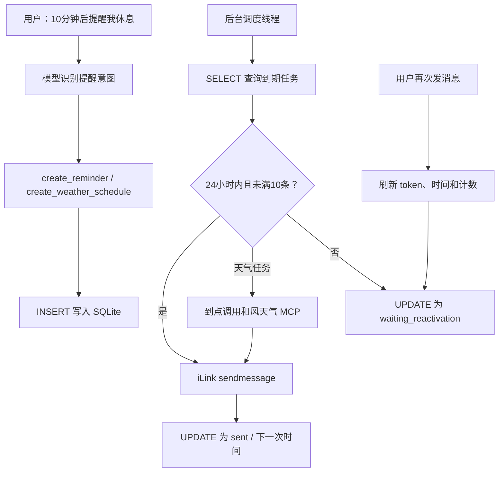

# SQLite 定时提醒技术文档

## 1. SQLite 是什么

SQLite 是一个“数据库文件 + 程序库”。它不需要单独启动数据库服务器，也没有账号、端口和后台服务。Python 自带 `sqlite3` 模块，项目第一次启动时会自动创建：

```text
ilink_catgirl/data/reminders.sqlite3
```

这个文件同时保存提醒任务、最近一次用户消息时间、最新 `context_token` 和本地发送计数。`data/` 已被 `.gitignore` 忽略，因为数据库包含微信用户标识和会话令牌，不应提交到 Git。

## 2. 从聊天到定时发送



定时器不是操作系统突然进入 Python 函数，而是一个后台线程不断执行：

```python
while not stop_event.is_set():
    due = store.claim_due(time.time())
    发送到期任务(due)
    stop_event.wait(1)
```

`stop_event.wait(1)` 表示最多等待一秒；程序退出时可以立即唤醒线程，比固定 `time.sleep(1)` 更容易安全停止。

## 3. 两张表

### 3.1 recipients：发送资格

```sql
CREATE TABLE recipients (
    user_id TEXT PRIMARY KEY,
    context_token TEXT NOT NULL,
    last_inbound_at REAL NOT NULL,
    outbound_count INTEGER NOT NULL DEFAULT 0,
    updated_at REAL NOT NULL
);
```

可以把一张表理解成 Excel 工作表：列定义数据含义，每一行是一条记录。

| 列 | 含义 |
| --- | --- |
| `user_id` | iLink 用户标识，也是主键，不允许重复 |
| `context_token` | 最近一条用户消息携带的会话令牌 |
| `last_inbound_at` | 最近主动消息的 Unix 时间戳 |
| `outbound_count` | 这次激活以后已发送的消息分片数 |
| `updated_at` | 最后更新时间 |

### 3.2 reminders：提醒任务

```sql
CREATE TABLE reminders (
    id INTEGER PRIMARY KEY AUTOINCREMENT,
    user_id TEXT NOT NULL,
    content TEXT NOT NULL,
    run_at REAL NOT NULL,
    timezone TEXT NOT NULL,
    repeat_kind TEXT NOT NULL DEFAULT 'once',
    action_kind TEXT NOT NULL DEFAULT 'message',
    action_args TEXT NOT NULL DEFAULT '{}',
    status TEXT NOT NULL DEFAULT 'pending',
    created_at REAL NOT NULL,
    sent_at REAL,
    last_error TEXT,
    FOREIGN KEY (user_id) REFERENCES recipients(user_id)
);
```

`id` 会自动从1递增；`user_id` 是外键，表示任务属于 `recipients` 中的哪一个用户。

`action_kind` 区分任务行为：`message` 表示发送固定文字，`weather` 表示触发时调用和风天气。`action_args` 使用 JSON 保存动作参数，例如：

```json
{"location": "河南省邓州市", "forecast_days": 3}
```

天气数据不会提前写进数据库。调度器到点后才读取这些参数并调用天气 MCP，所以每日任务发送的是当时的新数据。

任务状态：

| 状态 | 含义 |
| --- | --- |
| `pending` | 等待到期 |
| `sending` | 已被调度器领取，正在发送 |
| `waiting_reactivation` | 24小时窗口或下发额度不可用 |
| `sent` | 单次任务发送完成 |
| `cancelled` | 用户取消 |
| `failed` | 网络或程序错误导致发送失败 |

## 4. 最常用的四类 SQL

SQL 关键字习惯大写，但小写也能执行。

### 新增：INSERT

```sql
INSERT INTO reminders (
    user_id, content, run_at, timezone, repeat_kind, status, created_at
) VALUES (?, ?, ?, ?, ?, 'pending', ?);
```

问号是参数占位符。Python 会把数据安全地放进去，不要使用字符串拼接生成 SQL，否则可能产生 SQL 注入或引号错误。

### 查询：SELECT

```sql
SELECT id, content, run_at, status
FROM reminders
WHERE user_id = ? AND status = 'pending'
ORDER BY run_at;
```

可以按这样的顺序阅读：从 `reminders` 表选择四列，只保留指定用户且等待中的任务，再按执行时间排序。

### 修改：UPDATE

```sql
UPDATE reminders
SET status = 'sent', sent_at = ?
WHERE id = ?;
```

`WHERE` 非常重要。省略它会把整张表的任务全部改成 `sent`。

### 删除：DELETE

项目没有真正删除提醒，而是把状态改为 `cancelled`，这样以后还能排查。若确实要清理历史数据，可以执行：

```sql
DELETE FROM reminders
WHERE status IN ('sent', 'cancelled') AND sent_at < ?;
```

## 5. Python 怎样执行 SQL

项目中的核心写法是：

```python
with store._connection() as connection:
    row = connection.execute(
        "SELECT * FROM recipients WHERE user_id = ?",
        (user_id,),
    ).fetchone()
```

第二个参数必须是序列。只有一个值时要写 `(user_id,)`，末尾逗号表示这是单元素元组。

写操作离开上下文时自动提交；发生异常则回滚。连接随后显式关闭，避免 Windows 一直占用数据库文件。

## 6. 为什么需要事务和 sending 状态

调度器领取任务时执行：

```sql
BEGIN IMMEDIATE;

SELECT * FROM reminders
WHERE status = 'pending' AND run_at <= ?;

UPDATE reminders
SET status = 'sending'
WHERE id IN (...);
```

这一组操作处于同一个事务。`BEGIN IMMEDIATE` 会先取得写锁，防止两个调度线程同时领取同一条任务并重复发送。

项目还启用了 WAL：

```sql
PRAGMA journal_mode = WAL;
```

WAL（预写式日志）允许读取和写入更好地并行，适合机器人主线程与提醒线程同时访问数据库。

如果程序恰好在发送过程中崩溃，下次启动会把遗留的 `sending` 任务重新放回 `pending`。这偏向“宁可极少数情况下重复，也不要永久丢失”。

## 7. 微信24小时与10条限制

每次收到主动消息，程序使用 UPSERT：存在该用户就更新，不存在就插入。

```sql
INSERT INTO recipients (...)
VALUES (...)
ON CONFLICT(user_id) DO UPDATE SET
    context_token = excluded.context_token,
    last_inbound_at = excluded.last_inbound_at,
    outbound_count = 0;
```

定时发送前检查：

```text
当前时间 - last_inbound_at < 24小时
outbound_count < 10
```

为了保守遵守微信限制，程序把即时回复和定时发送的实际消息分片都计入 `outbound_count`。无法发送的提醒不会删除，而是进入 `waiting_reactivation`。收到下一条用户消息以后，计数归零、令牌刷新，等待任务重新变成 `pending`。

这只是本地保护。微信服务器仍是最终判断者；如果返回 `ret=-2` 或限流错误，任务会再次等待用户激活。

## 8. 模型工具

模型可以调用五个工具：

| 工具 | 作用 |
| --- | --- |
| `get_current_time` | 获取服务器当前时间与配置时区 |
| `create_reminder` | 创建单次或每日提醒 |
| `create_weather_schedule` | 创建到点后自动查询和风天气的单次/每日任务 |
| `list_reminders` | 查看尚未结束的任务 |
| `cancel_reminder` | 按编号取消任务 |

示例：

```text
10分钟后提醒我起来走走
今晚22点提醒我关电脑
每天早上8点把邓州最新天气发给我
查看我的提醒
取消提醒3
```

相对时间由模型传 `delay_minutes`，绝对时间使用 ISO 8601，例如：

```text
2026-08-16T22:00:00+08:00
```

每日任务也可以直接传 `08:00`。定时天气必须使用 `create_weather_schedule`；如果错误地使用普通 `create_reminder`，它只会发送固定文字，无法得到最新天气。

## 9. 在 Ubuntu 查看数据库

机器人运行时不需要安装 SQLite 命令行；如果你想学习和查看，可以安装：

```bash
sudo apt update
sudo apt install sqlite3
```

进入项目后打开数据库：

```bash
cd /myfolder/wechat_astrbot/ilink_catgirl
sqlite3 data/reminders.sqlite3
```

进入 SQLite 后：

```sql
.tables
.schema recipients
.schema reminders
.headers on
.mode column
SELECT id, content, datetime(run_at, 'unixepoch', 'localtime'), status
FROM reminders
ORDER BY run_at;
.quit
```

不要公开展示 `recipients.context_token`，它属于敏感会话数据。

## 10. 配置项

在父目录 `.env` 或 `ilink_catgirl/.env` 中配置，后者优先：

```dotenv
REMINDER_TIMEZONE=Asia/Shanghai
REMINDER_ACTIVE_HOURS=24
REMINDER_OUTBOUND_LIMIT=10
REMINDER_CHECK_INTERVAL_SECONDS=1
```

通常保持默认值即可。修改后重启机器人。

## 11. 测试

提醒测试不会连接微信或调用模型：

```bash
python -m unittest -v test_reminders.py
```

测试覆盖数据库持久化、旧表自动迁移、创建/查询/取消、到期发送、到点调用天气、发送计数、24小时窗口、额度耗尽、每日续排和 `ret=-2` 恢复。
