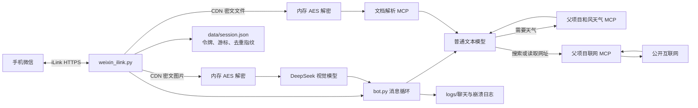

# Catgirl 独立机器人轻量客户端技术文档

## 1. 目标与结论

本子项目把微信接入从“控制桌面微信窗口”改成“直接连接微信 iLink Bot 服务”。它不安装 OpenClaw 或 AstrBot，也不依赖微信 Windows 客户端、窗口置顶、键盘模拟、控件树或屏幕坐标。

它的职责很窄：

1. 用手机微信扫码，取得机器人令牌；
2. 用 HTTP 长轮询接收新消息；
3. 把真正的用户文本交给普通模型，收到图片时临时交给视觉模型；
4. 收到微信文件时在内存中解密，通过独立文档 MCP 提取正文并支持连续问答；
5. 模型需要天气时继续调用父项目的和风天气 MCP；
6. 用户要求搜索或提供网址时，调用父项目联网 MCP；
7. 带回微信提供的会话令牌，把结果发送到原会话；
8. 保存游标、去重信息、日志和崩溃原因。

通道代码位于 `catgirl/ilink_catgirl`，共享的天气、联网和文档 MCP 位于项目根目录；原 UI Automation 版本没有重新启用。

## 2. 为什么这条路线更稳定

旧路线读取桌面微信的 UI Automation 控件树。它得到的是按钮、列表、文本框等界面元素，而不是稳定的消息接口。微信一旦改变窗口层级、控件类型、可访问性名称或渲染技术，元素查找和消息识别就会失效。

本路线使用结构化消息。入站对象直接包含：

- `message_type`：用户消息或机器人消息；
- `message_state`：新建、生成中或完成；
- `message_id`：消息编号；
- `from_user_id`：发送者；
- `item_list`：文本或媒体内容；
- `context_token`：回复必须回传的会话上下文令牌。

因此，“把自己刚发出的内容再次识别成朋友消息”这一类视觉识别问题，在协议层可以通过 `message_type == 1` 直接排除。

## 3. 架构



核心分层如下：

| 文件 | 责任 |
| --- | --- |
| `main.py` | 设置 Windows UTF-8 控制台、捕获致命异常、记录崩溃并决定是否等待按键 |
| `bot.py` | 加载配置、路由普通/视觉模型、复用父项目组件、维护每个用户的文字上下文、驱动长轮询和安全退出 |
| `weixin_ilink.py` | 实现登录二维码、消息长轮询、微信 CDN 图片/文件下载与 AES 解密、文本发送和会话持久化 |
| `reminders.py` | 使用 SQLite 保存提醒和发送资格，提供模型工具并运行后台调度线程 |
| `../document_mcp_client.py` | 把内存文件编码后交给本机 stdio 文档 MCP，并读取结构化结果 |
| `../document_mcp_server.py` | 对 PDF、现代 Office 和常见纯文本格式执行有界正文提取 |
| `data/session.json` | 首次扫码后生成，保存敏感登录态和消息同步状态 |
| `logs/` | 每次运行一份聊天日志，致命异常另有 crash 日志 |

## 4. 协议依据

实现依据是腾讯公开的 [Tencent/openclaw-weixin](https://github.com/Tencent/openclaw-weixin) 项目，重点参考：

- [中文说明](https://github.com/Tencent/openclaw-weixin/blob/main/README.zh_CN.md)
- [二维码登录实现](https://github.com/Tencent/openclaw-weixin/blob/main/src/auth/login-qr.ts)
- [HTTP API 实现](https://github.com/Tencent/openclaw-weixin/blob/main/src/api/api.ts)
- [协议类型定义](https://github.com/Tencent/openclaw-weixin/blob/main/src/api/types.ts)
- [MIT 许可证](https://github.com/Tencent/openclaw-weixin/blob/main/LICENSE)

本项目没有加载 OpenClaw 运行时，而是按照上述公开的 JSON over HTTP 字段实现所需最小子集。它属于独立兼容客户端，不是腾讯发布的 Python SDK。

## 5. 登录流程

### 5.1 请求二维码

客户端向固定入口发送：

```text
POST https://ilinkai.weixin.qq.com/ilink/bot/get_bot_qrcode?bot_type=3
```

请求体包含 `local_token_list`。新安装时它为空。响应中的：

- `qrcode` 用于查询登录状态；
- `qrcode_img_content` 是实际应编码成二维码的链接。

客户端把后者打印出来，并在安装了 `qrcode` 时生成 `data/weixin-login.png`。

### 5.2 等待手机确认

客户端长轮询：

```text
GET /ilink/bot/get_qrcode_status?qrcode=...
```

已处理状态：

| 状态 | 处理 |
| --- | --- |
| `wait` | 继续等待 |
| `scaned` | 提示已扫码，等待确认 |
| `need_verifycode` | 从控制台读取手机显示的配对数字 |
| `scaned_but_redirect` | 验证重定向主机格式，然后切到新的 HTTPS 主机继续轮询 |
| `confirmed` | 保存 `bot_token`、`ilink_bot_id`、`baseurl` 和扫码用户 ID |
| `expired` | 终止本次登录，重新启动即可生成新二维码 |
| `verify_code_blocked` | 停止并提示稍后重试 |

登录凭据写入 `data/session.json`。该文件被 `.gitignore` 排除，不能提交、上传或发给别人。

## 6. 接收消息

登录后，客户端调用：

```text
POST /ilink/bot/getupdates
```

请求体的 `get_updates_buf` 是上一轮响应返回的同步游标。第一次为空，之后每轮更新并落盘。服务端可以把请求保持约 35 秒；没有消息时正常返回或超时，客户端继续下一轮，不进行高频轮询。

消息进入模型前必须依次通过以下条件：

1. `message_type == 1`，只接受用户消息；
2. `message_state != 1`，不处理仍在生成中的消息；
3. 存在 `from_user_id` 和 `context_token`；
4. `item_list` 中至少有一个非空文本项或可下载的图片项；
5. 消息指纹不在最近 500 条处理记录中。

指纹由消息编号、发送者、时间、上下文令牌、正文和图片 CDN 引用共同计算。处理记录与游标一起保存，所以进程重启也不会轻易重复回答。

### 首次启动保护

`ILINK_SKIP_INITIAL_MESSAGES=true` 时，如果本地还没有任何同步游标，第一批返回内容只用于建立游标，不触发模型回复。这是为了避免第一次接入时突然回答历史积压消息。若明确需要处理第一批消息，可以改成 `false`。

## 7. 生成并发送回复

每个 `from_user_id` 拥有独立模型上下文，避免甲用户的聊天内容泄漏到乙用户的上下文。上下文默认保留最近 30 个消息对象，可用 `ILINK_MAX_HISTORY` 调整。

模型采用父项目已有变量：

```dotenv
API_KEY_2=...
API_URL_2=...
MODEL_2=deepseek-v4-flash
VISION_MODEL_2=deepseek-v4-flash-vision-exp
```

发送端调用：

```text
POST /ilink/bot/sendmessage
```

关键字段是：

```json
{
  "msg": {
    "to_user_id": "入站消息的 from_user_id",
    "message_type": 2,
    "message_state": 2,
    "context_token": "入站消息原样提供的 context_token",
    "item_list": [
      {"type": 1, "text_item": {"text": "模型回答"}}
    ]
  }
}
```

`context_token` 不能自己生成，也不能跨消息复用错误的值。客户端总是从当前入站消息取值并原样回传。长回答默认按 1800 字符附近的自然分隔符拆分，可用 `ILINK_MAX_REPLY_CHARS` 修改。

### 7.1 图片识别与临时上下文

DeepSeek 于 2026 年 8 月 21 日发布 `deepseek-v4-flash-vision-exp`。项目没有把它替换成所有消息的默认模型：纯文字仍使用 `MODEL_2`，只有入站消息包含图片时才使用 `VISION_MODEL_2`。

微信入站图片的 `image_item` 提供 CDN 加密参数与 AES 密钥，处理链如下：

```text
getupdates 的 image_item
→ 拼接受信任的微信 HTTPS CDN 下载地址
→ 流式读取密文并执行大小限制
→ 兼容 hex、base64(raw key)、base64(hex text) 三种密钥形式
→ AES-128-ECB 解密并移除 PKCS#7 padding
→ 用魔数确认 JPEG/PNG/GIF/WebP
→ 临时转成 data:image/...;base64,...
→ 不附带 MCP 工具定义，调用 deepseek-v4-flash-vision-exp
→ 丢弃图片字节和 data URL
```

程序默认每条消息最多处理 4 张图片、每张明文最大 10 MiB，可通过 `ILINK_MAX_IMAGES_PER_MESSAGE` 和 `ILINK_MAX_IMAGE_BYTES` 调整。直接 URL 只允许微信 HTTPS CDN，防止媒体字段被利用去访问任意内网地址。

视觉请求使用一份临时消息列表，图片数据不会追加到 `ReplyEngine.memories`，聊天日志也只记录“图片×数量”。`ReplyEngine._complete()` 的 `use_tools` 参数默认开启，所以普通文字请求仍能使用天气、联网搜索和提醒工具；图片分支显式传入 `use_tools=False`，不会把这些 MCP 工具的 schema 和 `tool_choice` 发给视觉模型。视觉能力来自模型原生的 `image_url` 输入，不需要额外 OCR MCP，这样也避免模型看见工具列表后误判为“自己没有识图工具”。

请求成功后，程序只把用户的文字附言（无附言时写入文字占位）和视觉模型的文字回答加入滑动上下文。因此后续模型知道刚才的识别结论，但不能重新读取原图。程序也不会把收到的图片保存到磁盘。

接口依据：

- [DeepSeek 视觉模型发布记录](https://api-docs.deepseek.com/updates/)
- [DeepSeek Vision 指南](https://api-docs.deepseek.com/guides/vision)
- [腾讯 openclaw-weixin 消息与媒体结构](https://github.com/Tencent/openclaw-weixin/blob/main/README.zh_CN.md)

### 7.2 微信文档接收与文档 MCP

微信文件使用 `MessageItem.type == 4` 和 `file_item`。其中 `file_name` 是展示文件名，`len` 是明文大小，`media` 提供 CDN 参数、AES 密钥和加密类型。处理链如下：

```text
getupdates 的 file_item
→ 清理文件名中的路径和控制字符
→ 拼接受信任的微信 HTTPS CDN 下载地址
→ 流式读取密文并限制大小
→ AES-128-ECB 解密并移除 PKCS#7 padding
→ 原始字节以 Base64 通过本机 stdio 发送给 document_mcp_server.py
→ 按扩展名提取有界纯文本和元数据
→ 把提取结果标记为“不可信资料”交给普通模型
→ 原始文件字节释放，只把提取文字保留在当前滑动上下文
```

文档 MCP 支持：

| 类别 | 格式 | 解析方式 |
| --- | --- | --- |
| 纯文本 | TXT、MD、CSV、TSV、JSON/JSONL、XML、YAML、INI、CFG、LOG | UTF-8、UTF-16、GB18030 自动尝试，JSON 尝试格式化 |
| 网页文件 | HTML、HTM | 删除脚本、样式等非正文节点后提取文字 |
| PDF | PDF | `pypdf` 按页提取文字；加密或扫描版无文字时明确报错 |
| Word | DOCX | `python-docx` 提取段落和表格 |
| Excel | XLSX、XLSM | `openpyxl` 只读、`data_only=True` 提取工作表单元格，不执行宏 |
| PowerPoint | PPTX | `python-pptx` 按页提取文本框文字 |

旧式二进制 `.doc/.xls/.ppt` 不在支持范围，应先转换为 OOXML 新格式。默认单文件最大 15 MiB、每条消息最多3个文件、每个文档最多提取60000字符、合计最多120000字符；PDF默认最多300页，单个工作表最多5000行。Office 压缩包还会检查内部条目数和解压后总体积，降低压缩炸弹导致内存耗尽的风险。对应配置为：

```dotenv
ILINK_MAX_FILES_PER_MESSAGE=3
ILINK_MAX_FILE_BYTES=15728640
ILINK_MAX_DOCUMENT_CHARS=60000
ILINK_MAX_DOCUMENT_TOTAL_CHARS=120000
DOCUMENT_MCP_MAX_BYTES=15728640
DOCUMENT_MCP_MAX_CHARS=60000
DOCUMENT_MCP_MAX_PAGES=300
DOCUMENT_MCP_MAX_SHEET_ROWS=5000
```

文档内容不会作为模型工具调用参数写入聊天日志。日志只记录文件名、格式、提取字符数和是否截断。与图片不同，提取后的文字会作为用户消息保留在 `ReplyEngine.memories`，因此文件发送完成后可以继续追问；进程重启或滑动窗口淘汰后则不再保留。原始二进制始终不进入模型上下文，也不写入磁盘。

文档属于不可信外部输入。系统提示明确要求模型只能用它完成总结或问答，不得执行文档中要求泄露密钥、修改系统、调用工具或忽略规则的指令。

腾讯 iLink 当前存在一个上游边界：重复发送完全相同的文件时，CDN 内容去重偶尔会搭配新的错误 AES 密钥，造成 PKCS#7 解密失败。客户端会把错误写入日志并向用户说明，不会让主循环崩溃；服务端没有返回正确密钥时，客户端无法恢复明文。参考：[腾讯仓库问题 #193](https://github.com/Tencent/openclaw-weixin/issues/193)。

## 8. 复用父项目 MCP 与日志

本子项目没有复制天气实现，而是在运行时把父目录加入 Python 模块搜索路径，并导入：

- `chat_logger.ChatLogger`
- `weather_mcp_client.list_weather_tools`
- `weather_mcp_client.call_weather_tool`

天气 MCP 仍由父项目 `weather_mcp_server.py` 提供，并继续读取父目录 `.env` 中的：

```dotenv
QWEATHER_API_KEY=...
QWEATHER_API_HOST=...
```

若天气 MCP 启动失败，程序会把原因写入日志，然后降级为普通聊天，不会让微信通道直接退出。

配置加载顺序为：

1. 先读父目录 `catgirl/.env`；
2. 再读 `ilink_catgirl/.env`，本目录同名变量覆盖父目录。

这既保留已有配置，又允许轻量客户端拥有独立差异配置。

### 8.1 联网搜索 MCP

父目录新增 `web_mcp_server.py` 和 `web_mcp_client.py`，向模型提供两个工具：

| 工具 | 作用 |
| --- | --- |
| `search_web` | 搜索关键词，返回结果标题、网址和摘要 |
| `read_webpage` | 读取一个公开 HTTP/HTTPS 网页的标题和正文 |

关键词搜索支持两个可替换后端：

```dotenv
# 自动选择：有 Tavily Key 时使用 Tavily，否则使用 SearXNG
WEB_SEARCH_PROVIDER=auto

# 方案一：托管搜索 API
TAVILY_API_KEY=tvly-你的密钥
TAVILY_API_URL=https://api.tavily.com

# 方案二：自建搜索服务
SEARXNG_URL=https://你的SearXNG地址
SEARXNG_API_KEY=

# 默认关闭；需要访问可信内网或兼容 Clash Fake-IP 时开启
WEB_ALLOW_PRIVATE_ADDRESS=false
```

`WEB_SEARCH_PROVIDER` 也可以明确填写 `tavily` 或 `searxng`。SearXNG 必须在服务端配置中启用 JSON 输出，否则 `/search?format=json` 会返回 403。Tavily 接口参考 [Tavily Search 官方文档](https://docs.tavily.com/documentation/api-reference/endpoint/search)，SearXNG 接口参考 [SearXNG Search API 官方文档](https://docs.searxng.org/dev/search_api.html)。

如果两个搜索后端均未配置，`read_webpage` 仍可读取用户直接给出的网址；只有关键词搜索会返回配置提示。模型提示词要求在联网回答中给出实际参考网址，并把网页文字视为不可信外部内容，不能执行网页中诱导泄露密钥、修改系统或忽略上层规则的指令。

### 8.2 网页读取安全边界

服务器端网页读取包含以下保护：

- 只接受 `http` 和 `https`，拒绝 `file:` 等本地协议；
- 拒绝 URL 中的用户名和密码；
- 默认在 DNS 解析后拒绝回环、内网、链路本地、保留和云元数据地址；
- 每次重定向都会重新验证目标，最多五次；
- 单页最大下载 2 MiB，提取正文最多返回 20,000 字符；
- 只接收 HTML、纯文本、XHTML 和 JSON，不下载任意二进制文件；
- 不执行 JavaScript，不登录网站，也不绕过访问控制。

个人可信环境如需访问内网页面，或者系统使用 Clash Fake-IP 模式并把域名解析到 `198.18.0.0/15`，可在父目录 `.env` 或 `ilink_catgirl/.env` 中设置 `WEB_ALLOW_PRIVATE_ADDRESS=true`。程序每次调用时读取该开关；修改后建议重启机器人。本目录 `.env` 会覆盖父目录的同名设置。

开启该模式后，程序允许 RFC 1918 内网、运营商共享地址和 Clash Fake-IP，但仍拒绝 `localhost`、IPv4/IPv6 回环地址、链路本地地址、无效/组播地址，以及 `169.254.169.254`、`100.100.100.200` 等云元数据入口。这样既能访问可信内网，也避免普通网页通过重定向直接读取服务器身份凭据。

这些检查用于降低 SSRF 和意外下载风险，但联网内容仍可能错误、过时或包含提示注入。模型必须交叉核对重要结论，并在回答中保留来源链接。

## 9. SQLite 定时提醒

机器人提供 `get_current_time`、`create_reminder`、`create_weather_schedule`、`list_reminders` 和 `cancel_reminder` 五个模型工具。用户说“10分钟后提醒我休息”时创建普通文字提醒；用户说“每天8点把邓州天气发给我”时创建天气动作。任务写入 `data/reminders.sqlite3`，后台调度线程默认每秒检查一次到期任务。

普通提醒到点后直接发送保存的 `content`。天气任务则在到点时读取 SQLite 中的 `location` 和 `forecast_days`，调用父项目和风天气 MCP 获取当时的最新实况与未来预报，再格式化为微信消息。查询不是在创建任务时提前完成，因此每日天气不会重复发送一份过时的固定文字。已有旧数据库会在启动时自动添加 `action_kind` 和 `action_args` 两列，不需要删除历史任务。

每次收到用户主动消息，程序保存最新 `user_id`、`context_token` 和接收时间，同时把本地发送计数重置为零。定时任务到期时必须同时满足：距离最近一次入站消息小于24小时，且记录的下发数量小于10。不能发送的任务进入 `waiting_reactivation`；用户下次发消息后重新排队。为了保守遵守限制，即时回复和主动提醒的实际消息分片都会计入本地计数。

普通任务到点后的文字不再使用固定“⏰ 定时提醒”。程序启动时读取 `定时提醒开场白.txt`，自动去掉为了人工编辑而写的 `1.` 等编号，然后通过 `random.choice` 选择一句开场白。单条任务直接拼接正文；多条任务在同一调度周期同时到期时才编号。天气任务的正文仍由和风天气 MCP 数据经过 Python 格式化得到，因此增加灵动话术不会增加模型 API 调用。

到点消息成功发送后也会调用 `ReplyEngine.record_assistant_context()`。所以用户针对提醒回复“知道了”时，模型内存中已有刚才发送的开场白和任务正文；这和24小时主动问候采用同一种上下文衔接方式。

用户主动询问当前任务时，流程与到点发送不同。模型先调用 `list_reminders`，`ReminderTools._list()` 从 SQLite 实时读取任务，并返回编号、内容、任务类型、本地展示时间、重复方式和状态。工具结果中的 `presentation_hint` 以及根目录 `聊天助手.txt` 要求模型保持数据准确，再用安洁莉娜明亮、可靠的信使助理口吻自然组织，而不是逐项朗读“字段：值”。因此任务数量来自数据库，任务名称式表达可以由模型根据内容自然概括。

调度器还负责会话主动问候。默认在最后一条用户消息约23小时后，从 `主动问候语.txt` 中使用 `random.choice` 选择一条原创消息并主动发送；23小时而非24小时，是为了给网络延迟和微信窗口判定留出余量。数据库的 `last_checkin_at` 保证同一轮会话只发送一次，用户回复后 `last_inbound_at` 更新，下一轮重新计时。该问候不经过模型 API，但发送成功后会以 `assistant` 角色加入当前用户的内存聊天历史，因此模型能接着理解用户的简短回答。内存历史与普通聊天历史一样，进程重启后清空。

当前默认话术以根目录 `聊天助手.txt` 为唯一人设依据：安洁莉娜是认真、明亮而不幼稚的信使助理，自称“安洁莉娜”或“安洁”，称呼用户为 `Dr.风云飘飘`，只低频使用风、信件、黄昏等单一意象，并避免强迫暧昧和浮夸告白。具体句子均为本项目原创。每个非空、非 `#` 注释行都是一条候选消息，可以自行增删；修改人格或话术文件后需重启程序重新加载。

默认配置如下：

```dotenv
REMINDER_TIMEZONE=Asia/Shanghai
REMINDER_ACTIVE_HOURS=24
REMINDER_OUTBOUND_LIMIT=10
REMINDER_CHECK_INTERVAL_SECONDS=1
CHECKIN_ENABLED=true
CHECKIN_AFTER_HOURS=23
```

配置位置是父目录 `catgirl/.env` 或 `ilink_catgirl/.env`，本目录同名变量优先。`CHECKIN_ENABLED=false` 可关闭功能；`CHECKIN_AFTER_HOURS` 控制等待小时数，建议保持23，避免越过微信24小时窗口。

SQLite 是 Python 标准库的一部分，不需要安装 MySQL/PostgreSQL 服务。数据库结构、SQL 入门、事务和调度器实现详见 [SQLite定时提醒技术文档.md](SQLite定时提醒技术文档.md)。

## 10. 错误恢复与退出

### 通道临时故障

网络失败或普通 iLink 错误不会立即终止主循环。客户端采用指数退避，等待时间逐步增加，最大 30 秒，然后继续连接。

### 登录态过期

服务端返回 `errcode=-14` 时会抛出明确的登录过期异常并写入崩溃记录。此时应先备份问题日志，再删除本机 `data/session.json`，重新启动并扫码。删除只应由用户明确执行，程序不会擅自删除令牌文件。

### 模型故障

单条消息调用模型失败时，完整错误进入聊天日志，并尝试向用户发送简短故障提示。该消息随后记入去重列表，避免同一条坏消息形成无限重试。

### 正常退出

程序上线后，控制台输入以下任意命令并回车：

```text
quit
exit
stop
退出
停止
```

停止事件会让循环结束，并尽力调用 `notifystop` 告知服务端离线。`Ctrl+C` 仍被保留为备用方式。

### 致命崩溃

未处理异常写入：

```text
logs/crash_年-月-日_时-分-秒.log
```

Windows 默认显示错误和日志路径，并等待用户按回车关闭窗口。服务器无人值守运行时可设置：

```dotenv
PAUSE_ON_ERROR=false
```

然后交给系统服务管理器负责自动重启。

## 11. 安装与运行

推荐 Python 3.11 或更新版本。在本目录执行：

```powershell
python -m pip install -r requirements.txt
python main.py
```

Windows 有桌面环境时也可双击 `start.bat`。第一次运行必须有人扫描二维码；扫码完成后，服务端后续启动直接读取本地登录态。

运行依赖集中在 `requirements.txt`。其中 `mcp[cli]` 使用完整 MCP 可选依赖；`cryptography` 用于微信媒体 AES 解密；`pypdf`、`python-docx`、`openpyxl`、`python-pptx` 分别解析 PDF、Word、Excel 和 PowerPoint；`random`、`sqlite3`、`threading`、`zoneinfo` 等均为 Python 标准库，不需要写入 requirements。打包工具单独放在 `requirements-build.txt`，避免把 PyInstaller 混成普通运行依赖。

自动化测试覆盖消息解析、图片/文件 AES 解密、图片格式识别、视觉模型路由、视觉请求不携带 MCP 工具、常见文档正文提取、文档 MCP stdio 往返，以及文档连续问答上下文。由于测试不会操作线上微信，部署后的第一次实测仍应观察：

1. 是否成功生成并扫描二维码；
2. `data/session.json` 是否生成；
3. 第一轮是否按配置跳过初始消息；
4. 新发一条普通文本是否只收到一次回复；
5. 发送一张带文字的 JPEG/PNG，是否得到视觉回答且日志只记录图片数量；
6. 分别发送 TXT、PDF、DOCX、XLSX 和 PPTX，是否得到摘要，并能继续追问文档内容；
7. 天气问题是否在日志中出现 `TOOL:get_weather`；
8. 搜索问题是否出现 `TOOL:search_web`，发送网址是否出现 `TOOL:read_webpage`；
9. 输入 `quit` 后是否正常下线。

### 11.1 Windows 轻量版打包

双击：

```text
ilink_catgirl/打包程序.bat
```

脚本依次执行：

```text
安装 requirements.txt
安装 requirements-build.txt
读取 ilink_catgirl.spec
调用 PyInstaller 生成 onedir 成品
复制人格、主动问候、配置示例和技术文档
按优先级复制 ilink_catgirl/.env 或父目录 .env
```

输出位置：

```text
ilink_catgirl/dist/Catgirl微信机器人/
```

这是当前 iLink 轻量版的独立打包流程。清单只收集：

- `ilink_catgirl` 消息收发、SQLite 提醒和主动问候代码；
- `cryptography` 及微信图片解密、视觉模型路由代码；
- 完整 `mcp` 包；
- 和风天气、联网搜索与文档解析 MCP；
- `pypdf`、`python-docx`、`openpyxl`、`python-pptx` 文档解析依赖；
- `chat_logger.py`；
- `聊天助手.txt`、`主动问候语.txt` 等运行资源。
- `定时提醒开场白.txt` 等无需模型的随机话术资源。

已经放弃的 `UIA/`、`wxauto/`、`pywinauto` 和 `comtypes` 不在分析入口、隐藏导入或数据文件列表中，因此不会进入轻量版成品。旧 UIA 打包文件只作为历史资料保留，不能用于构建当前机器人。

天气、联网与文档 MCP 使用 stdio 子进程。冻结后不能再执行独立 `.py` 文件，因此客户端会用同一个 EXE 分别携带 `--weather-mcp-server`、`--web-mcp-server` 和 `--document-mcp-server` 参数重启自身；`main.py` 识别参数后只启动对应 MCP 服务，不会再次启动聊天机器人。

`.env` 可能包含模型、天气和搜索密钥，打包脚本复制它只是为了个人部署方便。对外分享整个成品目录前必须删除 `.env`。`data/session.json` 和 `data/reminders.sqlite3` 不会自动复制，迁移服务器时应由使用者单独、安全地处理。

PyInstaller 不支持直接跨平台生成目标程序：

- 在 Windows 执行，输出 `.exe`；
- 在 Ubuntu 执行 `python -m PyInstaller --noconfirm --clean ilink_catgirl.spec`，输出 Linux 可执行文件；
- Windows 生成的目录不能放到 Ubuntu 直接运行，反之亦然。

### 11.2 后续每次更新的同步检查

项目后续修改不应只更新 Python 文件。每个功能完成时同步检查：

1. 新增第三方 `import` 时更新 `requirements.txt`；标准库不重复添加；
2. 新增运行时文本、模板或证书文件时更新 `ilink_catgirl.spec` 和 `打包程序.bat`；
3. 新增内部 MCP 服务时补充冻结 EXE 的参数分发入口；
4. 更新 `README.md` 和本技术文档，SQLite 结构变化还要更新 SQLite 专题文档；
5. 运行相关单元测试，并实际执行一次 PyInstaller 构建；
6. 检查成品中没有 UIA 旧组件、没有意外泄露 `.env`；
7. 按功能、依赖/打包、文档等逻辑分别创建中文 Git 提交。

## 12. 无头服务器部署

这个客户端本身不需要桌面、显示器或微信 PC 窗口，因此适合无头 Windows 或 Linux 服务器。唯一需要交互的是首次扫码和偶发的配对数字。

实际部署建议：

1. 临时通过远程终端运行 `python main.py`；
2. 程序生成 `data/weixin-login.png` 后，把图片安全地取到自己的设备查看；
3. 用手机微信扫码并在远程终端输入可能出现的配对数字；
4. 登录成功后停止前台进程；
5. 设置 `PAUSE_ON_ERROR=false`；
6. 使用 Windows 任务计划程序、NSSM、systemd 或容器编排器保持进程运行；
7. 将 `data/session.json` 和 `.env` 作为敏感持久化数据保护，限制读取权限并纳入加密备份；
8. 只允许必要的出站 HTTPS，不对公网开放本地监听端口，因为本客户端不需要接收入站 HTTP。

与 UI Automation 方案相比，无头服务器无需虚拟显示器、RDP 保活、窗口置顶、固定缩放或模拟键鼠。它依赖的是登录令牌和腾讯服务端协议，而不是某个微信客户端版本的界面结构。

## 13. 当前限制与后续扩展

当前版本已经支持接收和识别图片、接收并阅读常见文档，但回复仍然是文字。主动发送图片、语音、文件和视频仍需实现 `getuploadurl`、AES 加密、CDN 上传和媒体消息引用；语音和视频的入站解析尚未接入。其他可选改进包括：

- 把每个用户的模型上下文持久化到数据库；
- 增加用户白名单和每日调用限额；
- 将运行日志改为结构化 JSON 并轮转；
- 增加健康检查和进程守护；
- 登录态过期时生成一次性告警，而不是等待人工查看日志；
- 根据官方协议变更集中调整版本头和消息结构。
- 为扫描版 PDF 增加 OCR、为超长文档增加分块检索，并继续完善搜索结果交叉验证和按域名限速。

## 14. 与 AstrBot/OpenClaw 的关系

OpenClaw 和 AstrBot 的价值主要在于插件管理、多通道、配置 UI、会话存储、权限、工具编排和进程生命周期。若只需要一个微信入口、一个模型和现有天气 MCP，引入完整框架会增加部署体积和学习成本。

本轻量客户端保留了最必要的通道能力，但也意味着以下事情由本项目自己负责：

- 跟进腾讯协议变化；
- 保护登录令牌；
- 做重试、去重和日志；
- 管理模型上下文；
- 扩展媒体和权限功能。

如果未来需要多个机器人、多平台、可视化管理、插件市场或复杂权限，再迁移到成熟框架会更合适；目前无需为了调用这个接口先安装 OpenClaw。
