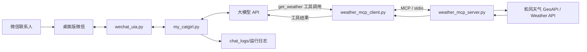
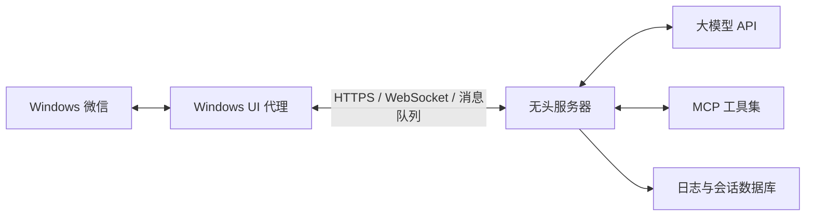

# Catgirl 微信聊天助手技术文档

更新日期：2026-08-15
适用环境：Windows、微信 4.x、Python 3.10+  
当前状态：微信收发、窗口置前、聊天日志、天气 MCP 均已完成并通过实际测试。

## 1. 项目目标

本项目把一个大模型聊天助手接入桌面版微信。程序监控指定联系人发来的新消息，把消息交给兼容 OpenAI Chat Completions 接口的模型，然后将模型回复发送回微信。

本次改造解决了四个核心问题：

1. 不再依赖 `wxauto4`，直接使用 Windows UI Automation 操作微信 4.x。
2. 通过微信 UI Automation 读取消息，启动时启用微信原生置顶，发送瞬间获取输入焦点。
3. 每次启动生成独立的聊天日志，文件名包含启动日期和时间。
4. 增加本地天气 MCP；模型可以自行判断是否查询天气，再根据真实数据回复。

## 2. 最终架构



这里有两条独立链路：

- 微信链路负责收消息和发消息。
- MCP 链路负责让大模型使用外部天气能力。

主程序把两条链路编排在一起，同时将关键事件写入日志。

## 3. 文件说明

| 文件 | 作用 |
| --- | --- |
| `my_catgirl.py` | 主程序；监听微信、维护上下文、调用模型、执行工具并发送回复 |
| `wechat_uia.py` | 自研微信 4.x UI Automation 适配层 |
| `chat_logger.py` | 按启动时间创建聊天日志，并记录用户、助手、工具和错误信息 |
| `weather_mcp_server.py` | 基于 FastMCP 的和风天气服务器，提供城市实况和每日预报 |
| `weather_mcp_client.py` | 启动本地 MCP 子进程、发现工具、调用工具，并转换为模型可用格式 |
| `聊天助手.txt` | 大模型的系统提示词 |
| `requirements.txt` | Python 依赖列表 |
| `.env` | 本地密钥和运行配置，不应提交到版本库 |

## 4. 从原项目到当前版本的改造过程

### 4.1 检查原项目和运行环境

原项目同时保留了微信、QQ 和博客方向的代码。本次只处理微信端，并沿用已有虚拟环境及 OpenAI 兼容模型接口。

最初代码通过 `wxauto4` 查找会话：

```python
wx.ChatWith(who="Inmost", exact=False)
```

运行时出现：

```text
ValueError: invalid literal for int() with base 10: '10条未读'
```

这不是虚拟环境问题，而是 `wxauto4 41.1.2` 在解析微信会话列表时，把“10条未读”整个字符串直接转成整数。相关实现封装在库的编译模块中，并且微信 4.x 的 UI 结构变化频繁，继续补丁式修复会比较脆弱。

因此，本项目改为只实现实际需要的最小能力，不再读取复杂的会话列表元数据。

### 4.2 自建微信 UI Automation 适配层

`wechat_uia.py` 使用 `pywinauto`、`pywin32` 和 Windows UI Automation。它只暴露主程序需要的几个方法：

- `ChatWith()`：搜索并切换联系人。
- `GetAllMessage()`：读取当前会话中屏幕上可见的消息。
- `SendMsg()`：填写文本、触发发送并确认结果。
- `BringToFront()`：恢复微信并将其切到前台。
- `SetAlwaysOnTop()`：操作微信右上角的原生置顶按钮。
- `Close()`：结束适配层生命周期，保留微信当前的置顶状态。

微信 4.x 中使用到的关键 Automation ID 包括：

| Automation ID | 含义 |
| --- | --- |
| `chat_message_list` | 当前聊天消息列表 |
| `chat_input_field` | 消息输入框 |
| `search_list` | 联系人搜索结果列表 |
| `*current_chat_name_label` | 当前聊天名称标签，前缀可能变化，因此使用后缀匹配 |

### 4.3 搜索并切换联系人

程序不解析左侧会话列表，而是找到微信的搜索编辑框，写入联系人名称，然后从 `search_list` 中选择匹配项。

选择以后，程序反复读取当前聊天标题，直到标题与目标联系人一致。这样既绕开了“未读条数”解析问题，也避免因为点击延迟而把消息发到错误会话。

### 4.4 读取消息与识别发送方向

UI Automation 能读取每条可见消息的文本和 Runtime ID，但微信没有直接暴露“这条消息是谁发的”。早期版本只采用消息行截图判断方向：

- 左侧边缘存在头像：好友消息。
- 右侧边缘存在头像：自己发送的消息。
- 两边都不像头像：时间提示或系统消息。

实际运行中发现两个边界情况：长文本气泡可能覆盖截图中心，导致背景色取样错误；
微信刷新可访问性树时，同一条旧消息也可能获得新的 Runtime ID。它们曾造成程序把
`21:34` 时间提示、自己刚发送的回复和旧的“下次见！”误记为 `USER`，继而产生
“机器人回复自己”的现象。

当前版本使用多层防护：

1. 在截图识别前用规则过滤 `21:34`、`昨天 21:34`、`8月14日 21:40` 等微信时间行。
2. 截图背景从消息行边框的多数颜色估计，不再取可能落在长气泡里的中心像素。
3. `SendMsg()` 确认新消息行后，立即把 `(Runtime ID, 正文)` 标记为 `self`。
4. 同时保留最近三分钟成功发送的正文；即使微信立刻重建消息行并更换 Runtime ID，
   内容相同的行仍会优先识别成 `self`。
5. 方向缓存使用 `(Runtime ID, 正文)` 作为键，避免微信复用 Runtime ID 时沿用旧方向。
6. 主程序启动时把全部可见消息设为基线，之后用 `MessageTracker` 只取新出现的好友行；
   不再只保存一个 `last_processed_friend_id`。
7. 同一轮出现的多条新好友文本会按显示顺序合并为一次提问，避免连续短句触发多次回复。

消息跟踪器最多保留 5000 个键，长期运行时会自动淘汰最旧记录，防止集合无限增长。

这个方案适合文本消息。图片、语音、文件、引用消息等内容仍需要单独增加解析规则。

### 4.5 解决消息发送失败

最初只通过 UI Automation 向编辑框设置文本时，微信界面虽然显示了文字，但 Qt 内部没有收到完整的键盘输入事件，发送按钮可能仍是禁用状态。直接调用按钮的 `InvokePattern` 也不稳定。

最终发送流程如下：

1. 用 UI Automation 把消息写入输入框。
2. 点击输入框并输入一个空格，再退格删除。这不会修改正文，但能触发微信正常的输入事件。
3. 等待“发送”按钮变为可用。
4. 在输入框上模拟 `Alt+S`，使用微信自身快捷键发送。
5. 等待消息列表出现内容相同、Runtime ID 全新的消息行，并立即标记为 `self`。
6. 如果无新消息行但输入框已清空，也视为成功；如果正文仍留在输入框，则明确报错，避免误判。

实际测试确认，`Alt+S` 是程序自动触发，而不是人工发送。

### 4.6 专用机器上的窗口策略

项目曾尝试通过前台守护线程反复调用 Windows 窗口 API。这种方式会不断抢走用户正在
使用的程序焦点。后来改为使用微信右上角自带的“置顶”按钮，由微信和窗口管理器维护
顶层状态，不再需要后台线程轮询。

当前主程序通过 `WeChat(always_on_top=True)` 明确启用置顶。初始化时先执行一次
`BringToFront()`，随后调用 `SetAlwaysOnTop(True)`。如果按钮显示“置顶”，程序点击一次；如果按钮已经显示
“取消置顶”，说明窗口已经置顶，不会重复点击。发送消息时 `SendMsg()` 仍会临时
聚焦输入框并执行 `Alt+S`，但程序不会持续循环抢夺键盘焦点。

如果暂时不希望程序主动置顶，可以把主程序中的参数改成
`WeChat(always_on_top=False)`。`False` 表示“不修改当前置顶状态”，并不等于主动
取消微信已经存在的置顶，因此退出时同样不会取消置顶。

`Close()` 不会调用 `SetAlwaysOnTop(False)`。因此无论通过微信“退出”命令还是结束
进程，微信都会保留置顶状态；同时避免退出阶段重新扫描已经关闭或失效的微信 UI，
从而防止清理阶段再次抛出 UIA 异常。

## 5. 聊天日志

### 5.1 命名规则

程序每次启动时在 `chat_logs` 目录创建一个新文件：

```text
chat_年-月-日_时-分-秒.log
```

例如：

```text
chat_2026-08-13_21-17-32.log
```

文件使用 UTF-8 编码，便于直接阅读和后续分析。

### 5.2 记录内容

日志角色包括：

- `SYSTEM`：程序启动、模型名称、连接状态、程序结束等。
- `USER`：从微信收到并实际处理的好友消息。
- `ASSISTANT`：程序成功发送的助手回复。
- `TOOL:get_weather`：天气工具的参数和完整结果。
- `ERROR`：运行时异常。

示例：

```text
[2026-08-13 21:17:32] [USER]
    郑州今天的天气怎么样？

[2026-08-13 21:17:33] [TOOL:get_weather]
    参数: {"location":"郑州","forecast_days":3}
    结果: {...}

[2026-08-13 21:17:34] [ASSISTANT]
    郑州今天有阵雨，出门建议带伞。
```

`.gitignore` 已忽略 `chat_logs/` 和 `*.log`，避免把私人聊天内容提交到版本库。

### 5.3 致命错误与防闪退

普通轮询错误会写入当前 `chat_*.log`，程序等待三秒后继续监听。即使向微信发送错误
通知再次失败，也只记录“错误通知发送失败”，不会因此让主循环退出。

配置缺失、依赖导入失败、微信初始化失败等无法继续运行的异常由最外层入口捕获，并在
`chat_logs` 中写入独立报告：

```text
crash_年-月-日_时-分-秒_进程号.log
```

报告包含异常类型、异常信息、Python 与系统版本、程序路径、工作目录和完整 traceback。
如果 EXE 所在目录不可写，程序会尝试写入系统临时目录下的
`Catgirl微信助手/chat_logs`。

双击 EXE 启动时，致命错误页面不会自动关闭。程序会等待用户按回车，用户也可以直接
关闭控制台窗口。天气 MCP 使用同一个 EXE 作为子进程，但子进程发生错误时不会等待
输入，避免主程序永久卡住。

这层保护从标准库导入后就已生效，第三方依赖缺失也能记录。不过，如果 PyInstaller
启动器本身无法加载 Python DLL，或者操作系统不兼容导致 Python 尚未开始执行，项目
代码没有运行机会，此类启动器级故障无法由 Python 写日志。

## 6. 天气 MCP

### 6.1 为什么使用 MCP

大模型本身不应该凭记忆回答实时天气。MCP 把“查询天气”定义成一个结构化工具，使模型能够：

1. 阅读工具名称、说明和参数结构。
2. 判断当前问题是否需要工具。
3. 生成结构化工具调用，而不是自己编造天气。
4. 接收真实查询结果，再组织自然语言答案。

### 6.2 MCP 服务端

`weather_mcp_server.py` 使用官方 MCP Python SDK 的 `FastMCP`，通过标准输入输出运行，提供：

```text
get_weather(location: str, forecast_days: int = 3)
```

参数说明：

- `location`：城市、区县或地点，例如“郑州”“北京市海淀区”。
- `forecast_days`：1 到 7 天，超出范围会被限制到合法值。

工具名和参数没有因为更换数据源而变化，因此模型与微信主程序不需要修改调用方式。
服务端只使用和风天气，调用流程为：

1. 从 `.env` 读取 `QWEATHER_API_KEY` 和 `QWEATHER_API_HOST`。
2. 调用和风 GeoAPI，把地名解析成 LocationID。
3. 使用 LocationID 并行查询 `/v7/weather/now` 实时天气与
   `/v7/weather/3d` 或 `/v7/weather/7d` 每日预报。
4. 统一返回气温、体感温度、湿度、降水、云量、气压、能见度、风速、风向、观测
   时间和未来预报，`source` 固定为 `QWeather`。

如果配置缺失、鉴权失败、请求超时或地点无法解析，工具会直接返回清晰错误，不会
换用其他天气数据源，避免不同来源精度和口径混杂。

和风 API Key 通过 `X-QW-Api-Key` 请求头发送，不会出现在请求 URL 或工具结果中。

### 6.3 MCP 客户端桥接

主程序目前使用 Chat Completions 兼容接口，而 MCP 服务器通过 stdio 通信，因此 `weather_mcp_client.py` 负责桥接：

1. 使用当前虚拟环境的 `sys.executable` 启动 `weather_mcp_server.py`。
2. 建立 MCP `ClientSession` 并初始化。
3. 调用 `list_tools` 获取工具定义。
4. 把 MCP 的 JSON Schema 转成 Chat Completions 的 `tools` 格式。
5. 模型返回工具调用后，执行 MCP 的 `call_tool`。
6. 把工具结果作为 `role=tool` 消息交回模型。

主程序最多允许模型连续执行三轮，防止模型异常地无限调用工具。

### 6.4 已完成的实际测试

以下不是只做了语法检查，而是已实际执行：

- MCP 客户端能发现 `get_weather`。
- MCP 能查询郑州并返回当前天气和三日预报。
- 当前模型能针对“郑州今天的天气怎么样”生成真实的工具调用。
- 主程序能够执行工具、把结果放回模型，并得到最终自然语言回答。
- 工具参数和结果会写入同一份聊天日志。

## 7. 配置与运行

### 7.1 环境变量

在项目根目录的 `.env` 中配置。不要把实际密钥写进文档或提交到 Git。

```dotenv
API_KEY_2=你的模型密钥
API_URL_2=兼容OpenAI接口的基础地址
MODEL_2=deepseek-v4-flash
WECHAT_TARGET=Inmost
WECHAT_EXE=D:\wechat\Weixin\Weixin.exe
QWEATHER_API_KEY=和风天气API_KEY
QWEATHER_API_HOST=控制台分配的API_Host
```

说明：

- `API_KEY_2` 必填。
- `API_URL_2` 按当前模型服务商要求填写。
- `MODEL_2` 不填时默认 `deepseek-v4-flash`。
- `WECHAT_TARGET` 不填时默认 `Inmost`。
- `WECHAT_EXE` 只在程序找不到或需要启动微信时使用；如果微信主窗口已经打开，可以不填。
- `QWEATHER_API_KEY` 和 `QWEATHER_API_HOST` 必须同时填写。Host 通常类似
  `abcxyz.qweatherapi.com`，程序会自动补全 `https://`。
- 未填写和风配置时聊天程序仍可启动，但调用天气 MCP 会明确提示缺少配置。

### 7.2 安装依赖

激活虚拟环境后执行：

```powershell
python -m pip install -r requirements.txt
```

MCP Python SDK 使用 1.x 稳定分支，因此依赖限定为：

```text
mcp>=1.27,<2
```

### 7.3 启动前检查

1. 登录桌面版微信。
2. 确保目标联系人可通过微信搜索找到。
3. 检查 `.env` 中模型配置。
4. 如果发送快捷键被微信设置修改，确认微信当前仍支持 `Alt+S`。

### 7.4 启动程序

```powershell
python my_catgirl.py
```

也可以直接双击项目根目录的 `启动微信助手.bat`。它使用现有的
`D:\12298\software\envs\myenv` 虚拟环境启动程序，不需要打开 VS Code。

启动后终端会显示本次日志路径。程序会切换到目标联系人、发送上线提示，然后轮询新消息。
如果初始化阶段出现致命错误，终端会显示崩溃日志路径并停留，直到用户按回车或关闭窗口。

聊天命令：

- `清空记忆`：清除本轮大模型上下文，保留系统提示词。
- `退出`：向微信发送“下次见！”并结束程序。

### 7.5 打包为 EXE

PyInstaller 并不是把 Python 源码翻译成 C++，而是分析入口文件的 `import`，
收集 Python 解释器、项目代码、第三方库和资源文件，再加上一个 Windows 启动器。
用户双击 EXE 后，启动器加载随程序分发的 Python 运行环境并执行
`my_catgirl.py`，因此目标电脑不需要另装 Python 或虚拟环境。

本项目的打包流程为：

```text
my_catgirl.py
    ↓ PyInstaller 分析 import
Python 解释器 + 项目模块 + 第三方依赖 + 聊天助手.txt
    ↓ catgirl.spec 组织文件
Catgirl微信助手.exe + _internal 依赖目录
```

双击 `打包EXE.bat`。脚本会检查并按需安装 PyInstaller，然后根据
`catgirl.spec` 生成目录版程序：

```text
dist\Catgirl微信助手\Catgirl微信助手.exe
```

完整输出结构大致如下：

```text
dist\
└─ Catgirl微信助手\
   ├─ Catgirl微信助手.exe
   ├─ .env                    # 打包脚本从项目根目录复制
   ├─ EXE使用说明.txt
   ├─ chat_logs\             # 首次运行后自动生成
   └─ _internal\             # Python、依赖库和内置资源
```

本项目使用目录版而不是单文件版，因为 UI Automation、MCP 和网络库依赖较多，
目录版启动更快，也更容易排查缺失组件。天气 MCP 在打包后会通过
`Catgirl微信助手.exe --weather-mcp-server` 启动自身的 MCP 子进程，因此目标电脑
不需要安装 Python。

打包脚本会把项目根目录现有的 `.env` 复制到 `dist\Catgirl微信助手\`，但不会把
密钥嵌入 EXE。这样本机生成后可以直接使用，同时仍可单独修改配置。整个
`Catgirl微信助手` 文件夹是一个整体，不能只复制其中的 EXE。对外分享程序前，
必须删除或替换成品目录中的 `.env`，避免泄露 API Key。

源码运行时，程序从项目根目录读取 `.env`；EXE 运行时，程序根据
`sys.executable` 找到 EXE 所在目录，再读取同目录的 `.env`。因此外置配置不会
影响双击使用，而且更换 API Key、模型、联系人或微信路径时不需要重新打包。

如果需要迁移到另一台 Windows 电脑，应复制整个 `dist\Catgirl微信助手` 文件夹，
然后修改该文件夹中的 `.env`。目标电脑仍需安装并登录桌面微信，但不需要 VS Code、
Python 或原来的虚拟环境。

当前成品内嵌 Python 3.11，因此目标系统至少应为 Windows 8.1，推荐 Windows 10/11。
CMD 和 PowerShell 只是启动程序的外壳，换用 PowerShell 不能解决 Python 运行时与
Windows 7 的兼容问题。若必须支持 Windows 7，需要使用 Python 3.8 和兼容的依赖
单独制作旧系统版本；当前 MCP SDK 要求 Python 3.10 以上，更合理的做法是让 Win7
机器只承担微信 UI 控制，把模型与天气 MCP 部署到较新的服务器。

不建议把 `.env` 直接加入 `catgirl.spec`：PyInstaller 不是密钥加密工具，打入 EXE
的配置仍有可能被提取，而且每次修改配置都要重新生成程序。

## 8. 常见故障与排查

| 现象 | 原因和处理 |
| --- | --- |
| 找不到微信主窗口 | 先登录并显示微信主窗口，或配置 `WECHAT_EXE` |
| 找不到联系人 | 检查 `WECHAT_TARGET` 与微信搜索结果是否完全一致 |
| 找不到微信置顶按钮 | 检查微信版本是否仍暴露“置顶/取消置顶”按钮，并确保主窗口已完整显示 |
| 发送按钮未启用 | 确认微信在前台、输入框可编辑，并检查微信版本和快捷键设置 |
| 12 秒内没有确认发送 | 先检查消息是否实际发出；若草稿仍在，说明发送失败，日志会记录异常 |
| 一直重复回复旧消息 | 查看日志中是否出现相同的 `[USER]`；检查消息跟踪基线和 Runtime ID 是否被大规模重建 |
| 把自己消息识别为好友消息 | 检查近期发送正文缓存是否命中；微信主题或缩放变化仍可能需要重新校准头像像素阈值 |
| 把 `21:34` 当成用户消息 | 检查微信是否换用了新的日期/时间文案，并把新格式加入系统消息规则 |
| 天气工具报网络错误 | 检查网络能否访问和风天气控制台分配的 API Host |
| 提示和风天气尚未配置 | 在项目或 EXE 同目录的 `.env` 填写 Key 和 API Host |
| 和风返回 401/403 | 检查 `QWEATHER_API_KEY` 是否属于当前项目，以及 Host 是否为控制台分配值 |
| 模型不调用天气工具 | 模型服务必须兼容 Chat Completions 的 `tools` 和 `tool_calls` |
| 中文显示乱码 | 日志文件本身是 UTF-8；打开文件或终端时显式选择 UTF-8 编码 |
| EXE 报错后一闪而过 | 新版本会写入 `chat_logs/crash_*.log` 并等待用户关闭；确认运行的是重新打包后的 EXE |
| 找不到崩溃日志 | 先检查 EXE 同目录的 `chat_logs`，再检查系统临时目录的 `Catgirl微信助手/chat_logs` |
| Windows 7 上 EXE 异常 | 当前包内嵌 Python 3.11，不支持 Win7；换 CMD、PowerShell 或管理员权限都不能解决运行时兼容性 |

## 9. 无头服务器如何实现

### 9.1 结论

当前 UI Automation 方案不能直接运行在真正无图形桌面的 Linux 无头服务器上。它依赖四个条件：

- Windows 图形会话存在。
- 桌面版微信已经登录并运行。
- 微信窗口的 UI Automation 树可以访问。
- 键盘焦点和前台窗口切换有效。

如果没有桌面会话，就没有微信窗口可抓取，也不能模拟 `Alt+S`。

### 9.2 方案一：带持久图形会话的 Windows 虚拟机

最少改造的办法是准备一台专用 Windows 虚拟机、云桌面或小型 Windows 主机：

1. 安装并登录微信。
2. 配置开机自启动和异常重启。
3. 保持一个未锁屏、未注销的交互式桌面会话。
4. 通过虚拟显示器、Hyper-V/VMware 控制台或合适的远程桌面方案维护它。
5. 在该会话中运行本程序。

注意：普通 Windows 服务运行在 Session 0，不能直接操作登录用户桌面；RDP 直接断开、锁屏或注销也可能让 UI Automation 和键盘模拟失效。因此这种方案能做到“无人值守”，但不是严格意义的“无图形界面”。

### 9.3 方案二：拆分成 Windows 微信代理和无头 AI 后端

这是继续使用个人微信时更合理的工程结构：



- Windows 代理只负责读取消息、发送消息和上报健康状态。
- 无头服务器负责模型调用、MCP、记忆、日志、权限和重试。
- 两端之间使用带鉴权和加密的 HTTP、WebSocket 或消息队列。
- 给每条消息分配业务 ID，利用幂等表防止网络重试造成重复回复。
- Windows 代理要有心跳、自动拉起微信、截图诊断和远程升级能力。

这样大部分逻辑都能在稳定的 Linux 服务器上运行，只有不可替代的微信 UI 操作留在 Windows 节点。

### 9.4 方案三：迁移到官方服务端接口

如果业务允许把入口从个人微信迁移到企业微信、微信客服、公众号或小程序，应优先使用官方回调和发消息 API。这样消息由服务器接口收发，不需要登录桌面微信，也不依赖窗口、分辨率、焦点和快捷键，才是真正适合无头部署的方式。

个人微信桌面客户端没有为这种机器人场景提供同等的公开服务端消息接口。不建议在正式账号上使用逆向协议、注入或非官方 Hook：除了版本维护成本，还存在账号安全和平台规则风险。

### 9.5 建议选择

- 个人实验、只有一个微信号：使用专用 Windows 虚拟机或小主机。
- 希望保留个人微信，但把 AI 集中部署：采用“Windows UI 代理 + Linux 后端”。
- 要求长期稳定、多人使用或商业化：迁移到企业微信/微信客服等官方接口。

## 10. 安全与隐私

- `.env` 已被 Git 忽略，不要在日志或截图中公开 API Key。
- `chat_logs` 包含真实聊天内容和天气查询参数，应限制文件访问权限并制定清理周期。
- 远程代理与后端之间必须启用 TLS 和双向鉴权。
- 不要把模型返回内容不经检查地用于执行系统命令。
- 天气工具目前是只读工具，输入会被限制，网络请求也设置了超时。

## 11. 后续可扩展方向

1. 把日志从文本升级为 SQLite，同时保留易读的文本导出。
2. 增加滚动消息列表和非文本消息解析。
3. 为 UI 控件变化增加自动截图和控件树诊断包。
4. 把 MCP 客户端改成长连接，减少每次工具调用启动子进程的开销。
5. 增加更多 MCP 工具，并为每个工具建立允许列表和权限等级。
6. 为 Windows 微信代理增加健康检查、离线告警和幂等消息队列。
7. 若转为官方微信渠道，将 UI 适配层替换为 Webhook/API 适配层，模型与 MCP 层可以继续复用。

## 12. 参考资料

- OpenAI Function Calling：<https://developers.openai.com/api/docs/guides/function-calling>
- OpenAI MCP 与 Connectors：<https://developers.openai.com/api/docs/guides/tools-connectors-mcp>
- MCP Python SDK：<https://github.com/modelcontextprotocol/python-sdk>
- MCP SDK 文档：<https://modelcontextprotocol.io/docs/sdk>
- 和风天气城市搜索：<https://dev.qweather.com/docs/api/geoapi/city-lookup/>
- 和风天气实时天气：<https://dev.qweather.com/docs/api/weather/weather-now/>
- 和风天气每日预报：<https://dev.qweather.com/docs/api/weather/weather-daily-forecast/>
- 腾讯 WeKnora 企业微信集成示例：<https://github.com/Tencent/WeKnora/blob/main/docs/IM集成开发文档.md>
